# Setup Chatbot Calendar Reminder (Express)

Proxy server-side berbasis Express.js untuk mengakses Google Calendar API menggunakan OAuth2 refresh token.
Client (n8n, Make, dsb.) cukup memanggil satu endpoint HTTP tanpa perlu mengelola OAuth sendiri.

---

## Cara Kerja

```
Client
        │  POST /api/calendar
        ▼
    Express server  —  berjalan sebagai proses Node.js (server-side)
        │  OAuth2 refresh_token > access_token otomatis
        ▼
  Google Calendar API v3
```

---

## Chatbot Persona

Untuk memandu pembuatan agent AI (Agent Assistant), berikut adalah persona yang bisa Anda gunakan pada pengaturan *System Prompt*:

> You are Calendar Reminder Assistant, a helpful and reliable AI assistant that helps users manage their Google Calendar. You can create, view, search, update, delete, and organize calendar events and reminders through natural conversations. Always understand the user's intent, ask for any missing required information when necessary, and provide clear, concise, and friendly responses. When handling dates and times, interpret relative expressions such as "today", "tomorrow", "next week", or "last Monday" accurately based on the current date. Your goal is to make scheduling simple, efficient, and effortless for every user.

---

## Struktur File

```
calendar-proxy-express/
├── index.js                       ← server utama dan semua handler API
├── package.json
├── package-lock.json
├── .env.example                   ← template environment variables
├── .env                           ← file lokal untuk secret dan kredensial
└── .gitignore
```

---

## Setup

### 1. Google Cloud

1. Buka [Google Cloud Console](https://console.cloud.google.com) > buat atau pilih project.
2. **APIs & Services > Library** > aktifkan **Google Calendar API**.

   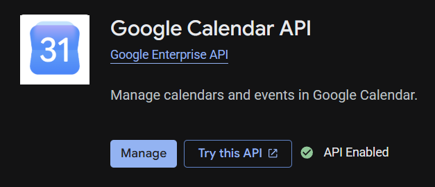

3. **APIs & Services > OAuth consent screen** > isi nama app dan email, tambahkan akun di **Test users** jika status masih *Testing*.

   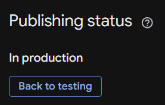

4. **APIs & Services > Credentials > Create Credentials > OAuth client ID**:
   - Application type: **Web application**
   - Authorized redirect URIs: `http://localhost:3000/oauth2callback`
   - Salin **Client ID** dan **Client Secret**.

   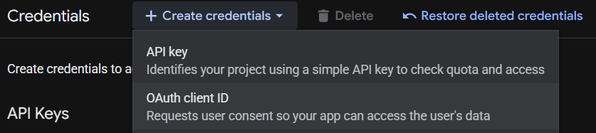

---

### 2. Instalasi Dependency

```bash
npm install
```

---

### 3. Ambil Refresh Token

Refresh token hanya perlu didapatkan sekali. Server akan me-refresh access token secara otomatis selanjutnya.

1. Ambil refresh token dengan flow OAuth2 sekali saja menggunakan script helper, OAuth Playground, atau tool lain yang kamu pakai.
2. Pastikan hasil akhirnya berupa nilai `GOOGLE_REFRESH_TOKEN`.
3. Simpan token itu ke file `.env` bersama kredensial lain.

---

### 4. Environment Variables

Copy `.env.example` jadi `.env`, lalu isi:

```env
PORT=3000
GOOGLE_CLIENT_ID=123456789012-abcdefgh.apps.googleusercontent.com
GOOGLE_CLIENT_SECRET=GOCSPX-xxxxxxxxxxxxxxxxxxxxxxxxxxx
GOOGLE_REFRESH_TOKEN=1//0gxxxxxxxxxxxxxxxxxxxxxxxxxxxxxxxxxxxxxxxxxxxxxxxx
GOOGLE_CALENDAR_ID=primary
DEFAULT_TIMEZONE=Asia/Jakarta
PROXY_SECRET=string-acak-panjang-dan-unik
```

---

### 5. Test Lokal (Opsional)

```bash
npm run dev
```

Uji endpoint menggunakan **Postman**:

1. Method `POST`, URL `http://localhost:3000/api/calendar`
2. Tab **Body** > **raw** > **JSON**
3. Isi body, klik **Send**:

```json
{
  "secret": "string-acak-panjang-dan-unik",
  "action": "list",
  "start": "2026-08-01T00:00:00+07:00",
  "end":   "2026-08-31T23:59:59+07:00"
}
```

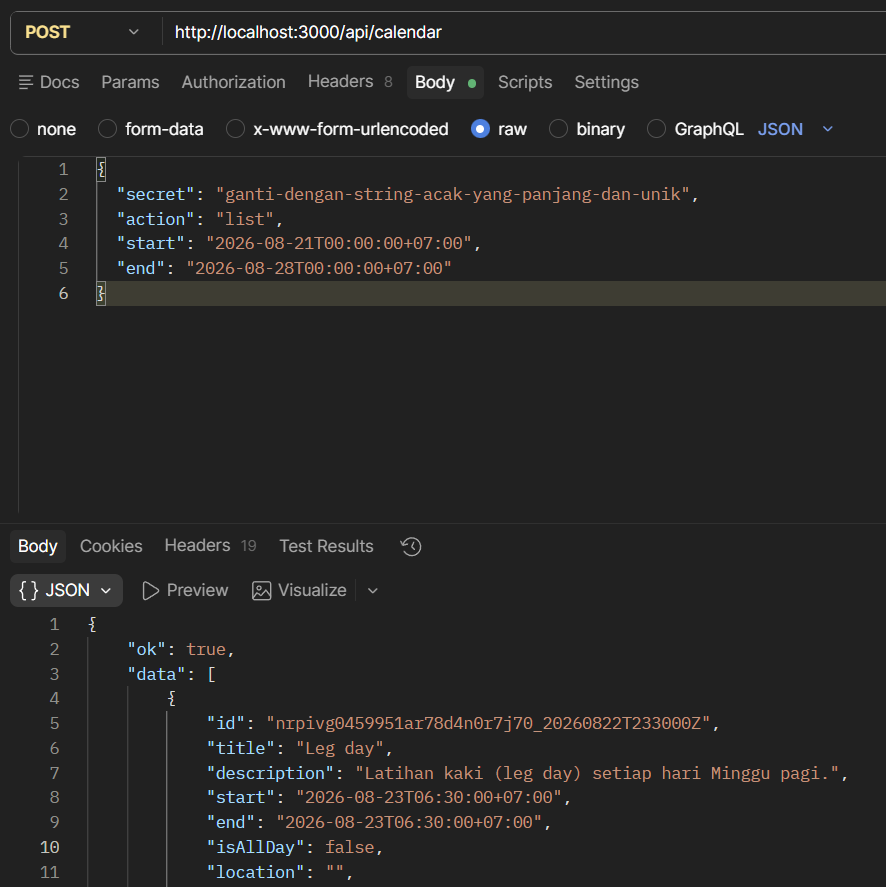

---

### 6. Deploy ke Vercel (Direkomendasikan)

Proyek backend Express ini dapat dengan mudah di-deploy ke Vercel sebagai serverless function. Berdasarkan [Dokumentasi Resmi Vercel untuk Express](http://vercel.com/docs/frameworks/backend/express), berikut langkah-langkahnya:

1. **Deploy dari Vercel Dashboard**:
   - Buka [Vercel Dashboard](https://vercel.com) > klik **Add New Project**.
   - **Opsi Import:**
     - *Paling Cepat:* Pada bagian bawah, klik **Import Third-Party Git Repository**, lalu *paste* link GitHub proyek ini: `https://github.com/mamatqurtifa/calendar-reminder-and-backend-proxy-express.git`
     - *Alternatif:* Unduh [index.js](https://raw.githubusercontent.com/mamatqurtifa/calendar-reminder-and-backend-proxy-express/main/index.js) dan [package.json](https://raw.githubusercontent.com/mamatqurtifa/calendar-reminder-and-backend-proxy-express/main/package.json) ke repository GitHub kosong, lalu import repository tersebut di Vercel.
2. **Setup Environment Variables di Vercel**:
   - Di halaman konfigurasi deploy (atau nantinya di **Settings** > **Environment Variables**), masukkan konfigurasi `.env`.
   - Anda bisa langsung **mengunggah file `.env`** atau **copy-paste seluruh isi `.env`** Anda ke kolom yang tersedia, dan semua variabel akan otomatis terisi. Anda tidak perlu memasukkan `PORT`.
   - *Catatan:* Jika Anda mengubah/menambahkan env var *setelah* project ter-deploy, Anda perlu mendeploy ulang. Masuk ke tab **Deployments** di dashboard, klik titik tiga pada deployment terbaru Anda, lalu pilih **Redeploy**.

**URL endpoint:**
```
https://<domain-vercel-anda.vercel.app>/api/calendar
```

---

### 7. Buat Workflow di Botika Platform Agentic

Setelah backend proxy berhasil berjalan (baik di lokal maupun Vercel), langkah selanjutnya adalah memasang *workflow* berikut:

1. Buka file [`workflow.txt`](./workflow.txt) yang ada di dalam repositori ini. File tersebut berisi kode template (JSON) dari seluruh *flow* Calendar Reminder.
2. *Copy* seluruh isi dari file tersebut.
3. Buka dashboard/editor workflow di [**Botika Platform v3 Agentic**](https://platform.botika.online/gpt/).
4. *Paste* kode tersebut di workflow untuk meng-*import* seluruh *node*.
5. **Sesuaikan Persona**, klik tab sebelah kiri pada bagian persona kemudian isi persona sesuai dengan referensi teks di bagian [Chatbot Persona](#chatbot-persona) di atas.
6. Sesuaikan secret dan ganti dengan secret yang sudah anda buat sebelumnya pada node *Set User Variabel* setelah node *Start* dan node *Log Monitoring*.
7. Pastikan endpoint di setiap node *HTTP Request* sudah mengarah ke URL Vercel Anda yang baru saja di-*deploy* (misal: `https://<domain-vercel-anda.vercel.app>/api/calendar`).

---

## Dokumentasi API

### Umum

| Item | Detail |
|---|---|
| **Endpoint** | `POST /api/calendar` |
| **Content-Type** | `application/json` |
| **Autentikasi** | Field `secret` di body (harus cocok dengan `PROXY_SECRET`) |
| **CORS** | Diizinkan dari semua origin (`*`) |

**Format respons sukses:**
```json
{ "ok": true, "data": { ... } }
```

**Format respons error:**
```json
{ "ok": false, "error": "Pesan error" }
```

---

### Objek Event

Field yang dikembalikan pada setiap event:

| Field | Tipe | Keterangan |
|---|---|---|
| `id` | `string` | ID unik event di Google Calendar |
| `title` | `string` | Judul event |
| `description` | `string` | Deskripsi (bisa kosong) |
| `start` | `string` | Waktu mulai (ISO 8601) |
| `end` | `string` | Waktu selesai (ISO 8601) |
| `isAllDay` | `boolean` | `true` jika event seharian penuh |
| `location` | `string` | Lokasi (bisa kosong) |
| `recurringEventId` | `string \| null` | ID event induk jika ini adalah instance dari event berulang |

---

### `list` — Ambil daftar event

| Field | Tipe | Wajib | Keterangan |
|---|---|---|---|
| `secret` | `string` | ✓ | Secret key |
| `action` | `string` | ✓ | `"list"` |
| `start` | `string` | ✓ | Waktu mulai rentang (ISO 8601) |
| `end` | `string` | ✓ | Waktu selesai rentang (ISO 8601) |
| `calendarId` | `string` | x | Default: `GOOGLE_CALENDAR_ID` |

```json
{
  "secret": "...",
  "action": "list",
  "start": "2026-07-01T00:00:00+07:00",
  "end":   "2026-07-31T23:59:59+07:00"
}
```

---

### `add` — Tambah event baru

| Field | Tipe | Wajib | Keterangan |
|---|---|---|---|
| `secret` | `string` | ✓ | Secret key |
| `action` | `string` | ✓ | `"add"` |
| `title` | `string` | ✓ | Judul event |
| `start` | `string` | ✓ | Waktu mulai (ISO 8601) |
| `end` | `string` | ✓ | Waktu selesai (ISO 8601) |
| `description` | `string` | x | Deskripsi |
| `location` | `string` | x | Lokasi |
| `reminders` | `array` | x | Lihat [Format Reminders](#format-reminders) |
| `recurrence` | `object` | x | Lihat [Format Recurrence](#format-recurrence) |
| `calendarId` | `string` | x | Default: `GOOGLE_CALENDAR_ID` |

**Event biasa:**
```json
{
  "secret": "...",
  "action": "add",
  "title": "Rapat Bulanan",
  "start": "2026-07-25T14:00:00+07:00",
  "end":   "2026-07-25T15:00:00+07:00",
  "description": "Review target bulan Juli",
  "location": "Zoom",
  "reminders": [
    { "method": "popup", "minutes": 30 },
    { "method": "email", "minutes": 60 }
  ]
}
```

**Event berulang (setiap Senin & Rabu, 10 kali):**
```json
{
  "secret": "...",
  "action": "add",
  "title": "Standup",
  "start": "2026-07-21T09:00:00+07:00",
  "end":   "2026-07-21T09:15:00+07:00",
  "recurrence": {
    "type": "weekly",
    "interval": 1,
    "weekdays": ["MONDAY", "WEDNESDAY"],
    "count": 10
  }
}
```

---

### `edit` — Ubah event

Partial update — hanya field yang dikirim yang diubah.

| Field | Tipe | Wajib | Keterangan |
|---|---|---|---|
| `secret` | `string` | ✓ | Secret key |
| `action` | `string` | ✓ | `"edit"` |
| `eventId` | `string` | ✓ | ID event yang ingin diubah |
| `title` | `string` | x | Judul baru |
| `start` | `string` | x | Waktu mulai baru (wajib bersama `end`) |
| `end` | `string` | x | Waktu selesai baru (wajib bersama `start`) |
| `description` | `string` | x | Deskripsi baru |
| `location` | `string` | x | Lokasi baru |
| `reminders` | `array` | x | Pengingat baru |
| `calendarId` | `string` | x | Default: `GOOGLE_CALENDAR_ID` |

```json
{
  "secret": "...",
  "action": "edit",
  "eventId": "abc123xyz",
  "title": "Rapat Bulanan (Reschedule)",
  "start": "2026-07-26T14:00:00+07:00",
  "end":   "2026-07-26T15:00:00+07:00"
}
```

---

### `delete` — Hapus event

Jika `eventId` adalah ID series maka semua instance terhapus. Jika ID instance maka hanya instance tersebut yang terhapus.

| Field | Tipe | Wajib | Keterangan |
|---|---|---|---|
| `secret` | `string` | ✓ | Secret key |
| `action` | `string` | ✓ | `"delete"` |
| `eventId` | `string` | ✓ | ID event yang ingin dihapus |
| `calendarId` | `string` | x | Default: `GOOGLE_CALENDAR_ID` |

```json
{
  "secret": "...",
  "action": "delete",
  "eventId": "abc123xyz"
}
```

---

### `search` — Cari event

Pencarian dilakukan di judul, deskripsi, lokasi, dan nama attendee.

| Field | Tipe | Wajib | Keterangan |
|---|---|---|---|
| `secret` | `string` | ✓ | Secret key |
| `action` | `string` | ✓ | `"search"` |
| `query` | `string` | x | Kata kunci. Jika kosong, mengembalikan semua event dalam rentang `start`–`end` |
| `start` | `string` | x | Default: sekarang |
| `end` | `string` | x | Default: 1 tahun dari sekarang |
| `calendarId` | `string` | x | Default: `GOOGLE_CALENDAR_ID` |

```json
{
  "secret": "...",
  "action": "search",
  "query": "rapat",
  "start": "2026-07-01T00:00:00+07:00",
  "end":   "2026-07-31T23:59:59+07:00"
}
```

---

### Format Reminders

```json
[
  { "method": "popup", "minutes": 10 },
  { "method": "email", "minutes": 60 }
]
```

| Field | Nilai | Keterangan |
|---|---|---|
| `method` | `"popup"` / `"email"` | Tipe pengingat |
| `minutes` | bilangan bulat positif | Menit sebelum event |

Jika tidak dikirim atau kosong, digunakan pengingat default akun Google.

---

### Format Recurrence

```json
{
  "type": "weekly",
  "interval": 1,
  "weekdays": ["MONDAY", "WEDNESDAY"],
  "count": 10
}
```

| Field | Tipe | Keterangan |
|---|---|---|
| `type` | `"daily"` / `"weekly"` / `"monthly"` / `"yearly"` | Frekuensi |
| `interval` | `number` | Kelipatan (default: `1`) |
| `weekdays` | `string[]` | Khusus `weekly`. Nilai: `MONDAY` – `SUNDAY` |
| `until` | `string` | Tanggal berakhir (ISO 8601). Tidak bisa bersama `count` |
| `count` | `number` | Jumlah total pengulangan. Tidak bisa bersama `until` |

---

### Kode Status HTTP

| Kode | Keterangan |
|---|---|
| `200` | Berhasil |
| `400` | Request tidak valid (JSON rusak, action tidak dikenali, parameter wajib hilang) |
| `401` | Secret key salah |
| `500` | Error server atau Google Calendar API |

---

# Workflow

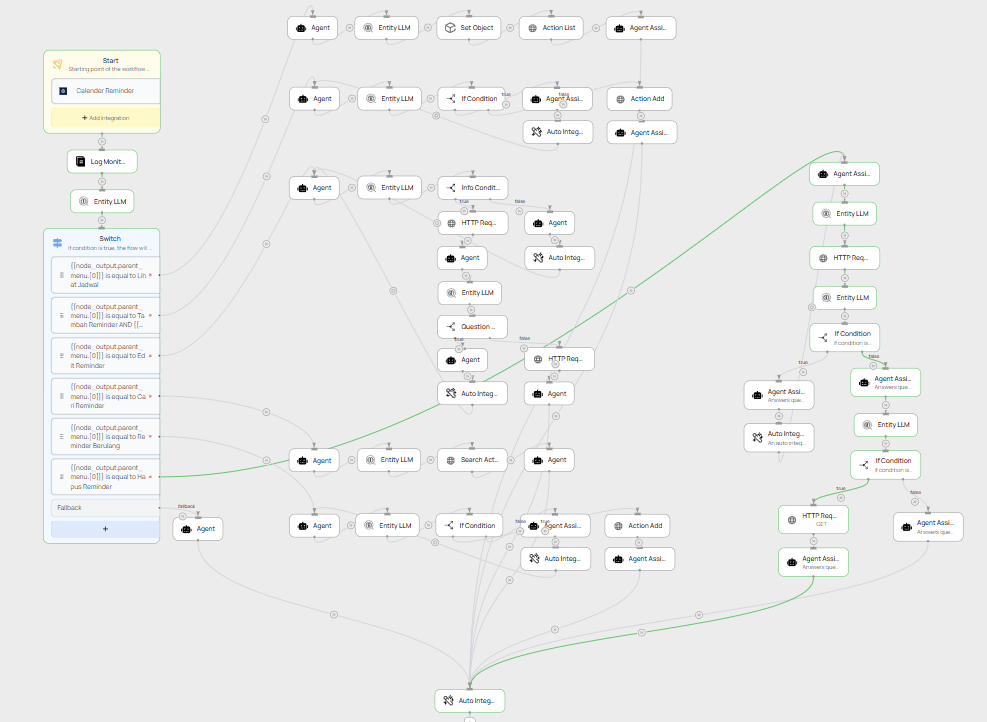

## Working Bot Footage

Berikut adalah cuplikan layar atau rekaman saat bot sedang berjalan dan memproses data kalender secara langsung untuk masing-masing alur (workflow):

### 1. Lihat Jadwal
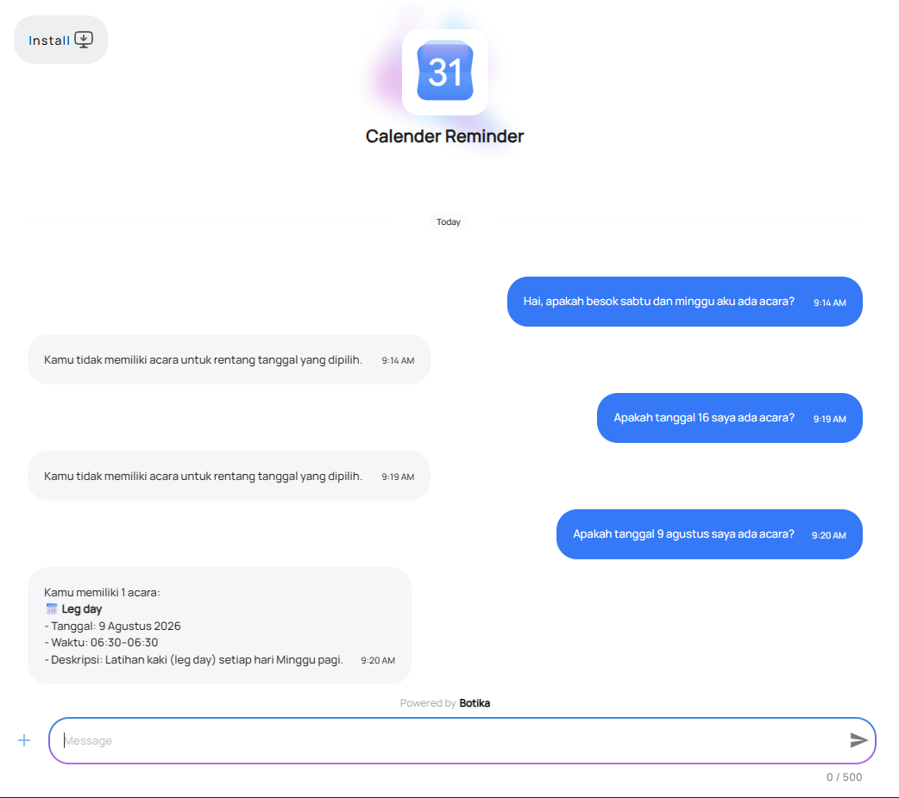

### 2. Tambah Jadwal (Reminder)
| Percakapan Bot | Hasil di Google Calendar |
|---|---|
| 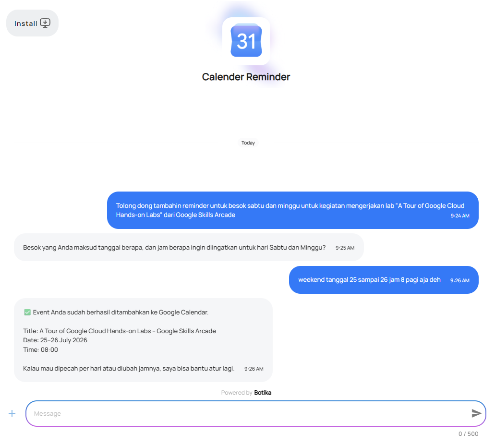 | 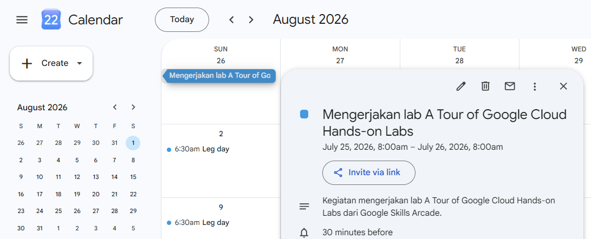 |

### 3. Edit Jadwal
| Percakapan Bot | Hasil di Google Calendar |
|---|---|
| 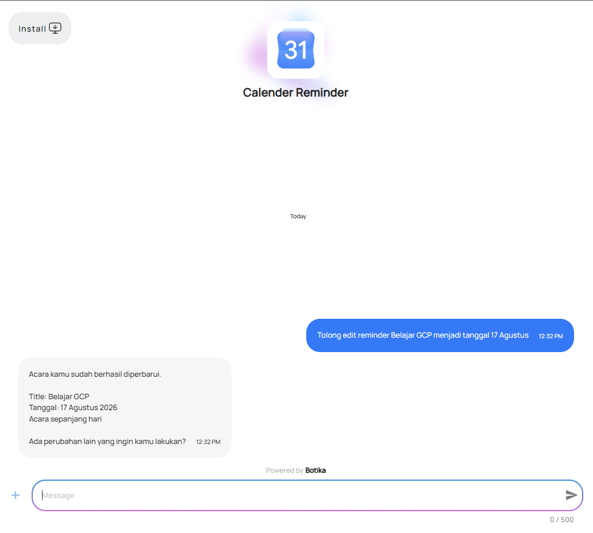 | 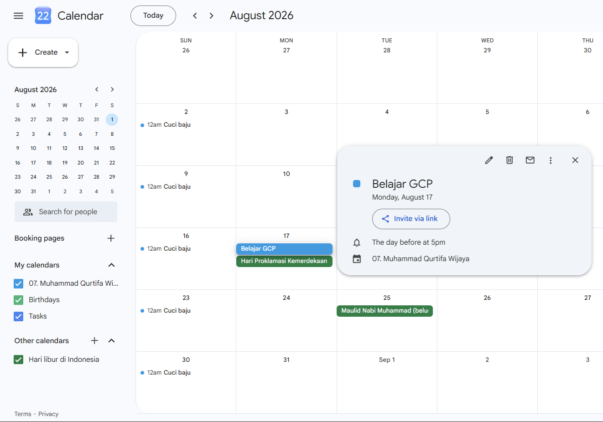 |

### 4. Cari Jadwal
| Percakapan Bot | Hasil di Google Calendar |
|---|---|
| 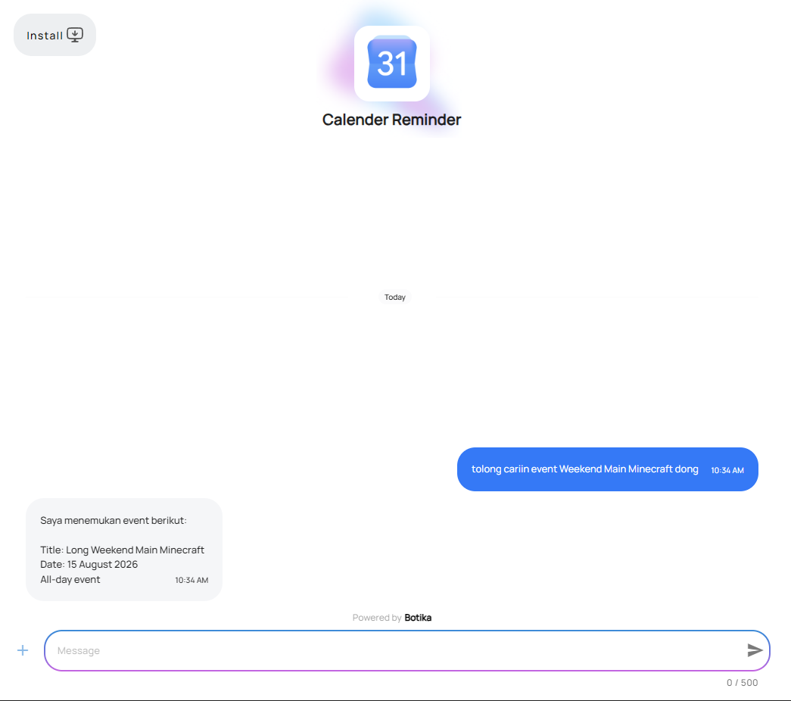 | 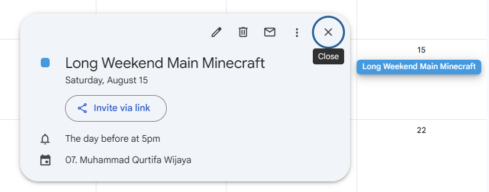 |

### 5. Tambah Jadwal Berulang
| Percakapan Bot | Hasil di Google Calendar |
|---|---|
| 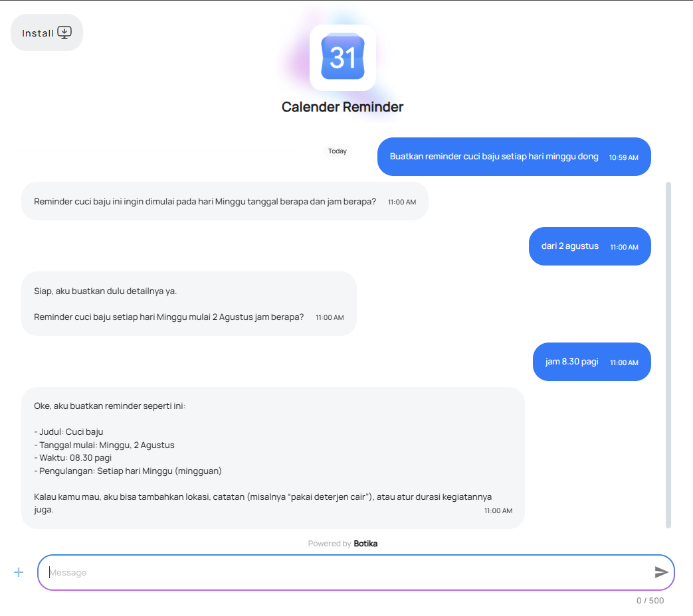 | 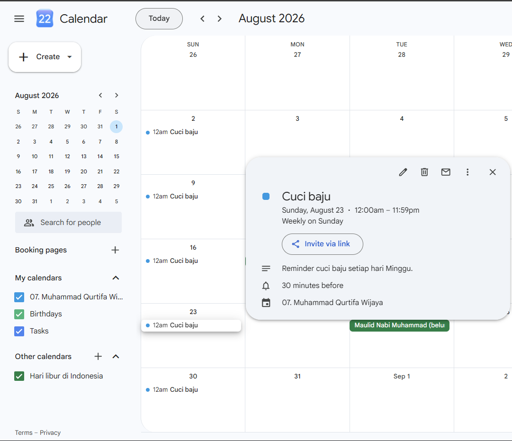 |

### 6. Hapus Jadwal
| Percakapan Bot | Hasil di Google Calendar |
|---|---|
| 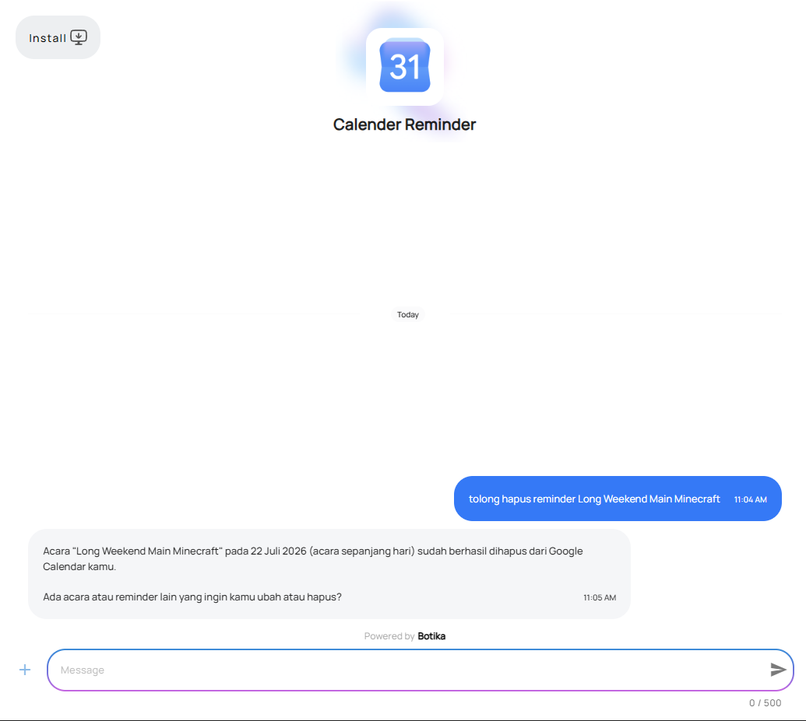 | 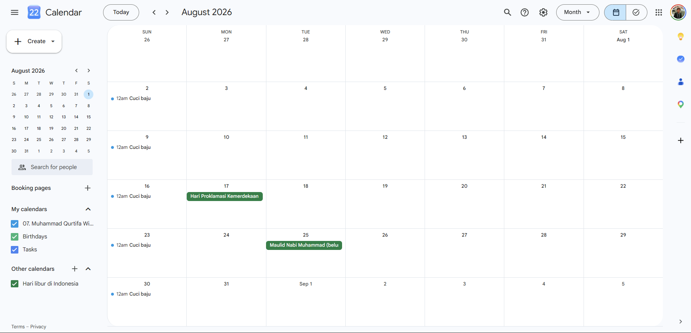 |