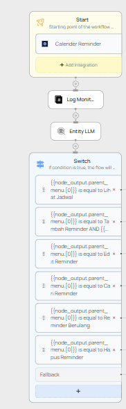
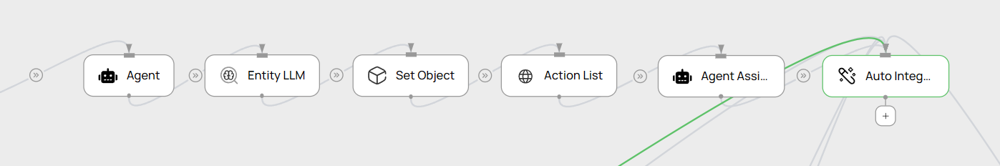
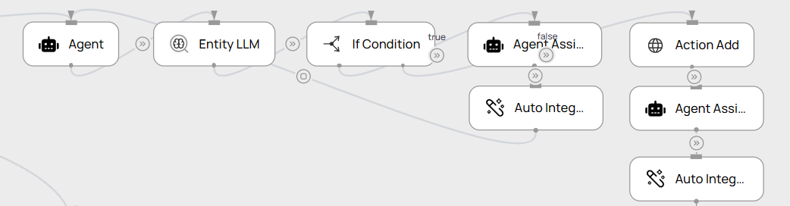
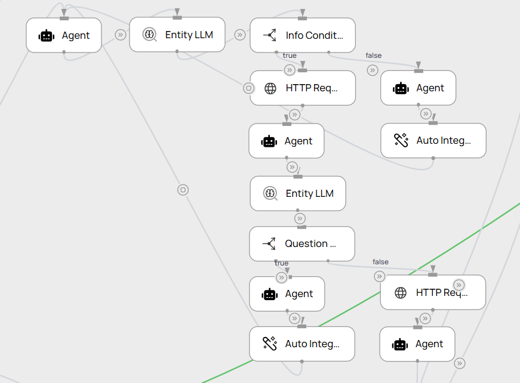
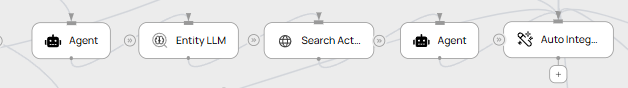
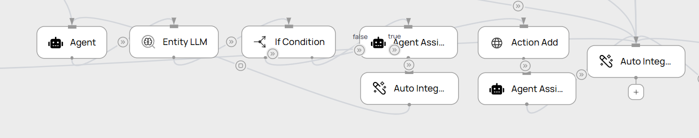
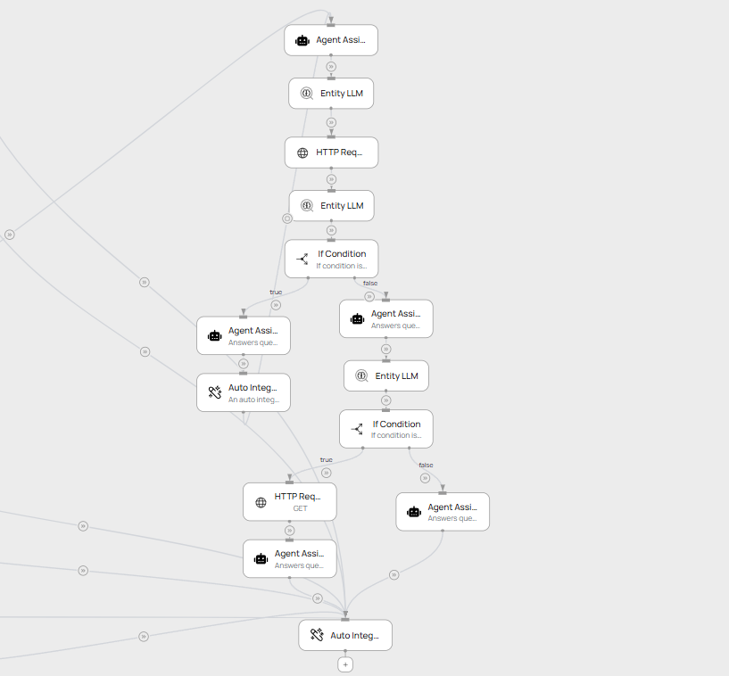
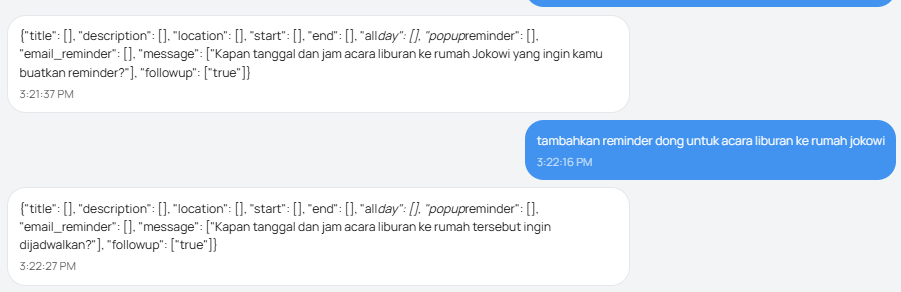

# Setup Google Calendar Proxy

Proxy server-side untuk mengakses Google Calendar API menggunakan OAuth2 refresh token.
Client (n8n, Make, dsb.) cukup memanggil satu endpoint HTTP tanpa perlu mengelola OAuth sendiri.

---

## Cara Kerja

```
Client
        │  POST /api/calendar  { secret, action, ...params }
        ▼
  Next.js API Route  —  berjalan di Vercel (server-side)
        │  OAuth2 refresh_token > access_token otomatis
        ▼
  Google Calendar API v3
```

---

## Struktur File

```
calendar-proxy-nextjs/
├── app/api/calendar/
│   └── route.ts                   ← endpoint utama (POST /api/calendar)
├── lib/
│   └── google-calendar.ts         ← helper auth, format event, RRULE, reminders
├── scripts/
│   ├── get-refresh-token.js       ← dijalankan sekali untuk setup awal
│   └── get-refresh-token.js.example
├── .env.example
└── package.json
```

---

## Setup

### 1. Google Cloud

1. Buka [Google Cloud Console](https://console.cloud.google.com) > buat atau pilih project.
2. **APIs & Services > Library** > aktifkan **Google Calendar API**.

   

3. **APIs & Services > OAuth consent screen** > isi nama app dan email, tambahkan akun di **Test users** jika status masih *Testing*.

   

4. **APIs & Services > Credentials > Create Credentials > OAuth client ID**:
   - Application type: **Web application**
   - Authorized redirect URIs: `http://localhost:3000/oauth2callback`
   - Salin **Client ID** dan **Client Secret**.

   

---

### 2. Instalasi Dependency

```bash
npm install googleapis
```

---

### 3. Ambil Refresh Token

Refresh token hanya perlu didapatkan sekali. Server akan me-refresh access token secara otomatis selanjutnya.

1. Copy `scripts/get-refresh-token.js.example` menjadi `scripts/get-refresh-token.js`, lalu isi `CLIENT_ID` dan `CLIENT_SECRET`.
2. Jalankan:
   ```bash
   node scripts/get-refresh-token.js
   ```
3. Buka URL yang muncul di browser, login, dan izinkan akses.
4. Salin nilai `code=` dari address bar setelah redirect, paste ke terminal.
5. Salin nilai `GOOGLE_REFRESH_TOKEN` yang ditampilkan.

---

### 4. Environment Variables

Copy `.env.example` jadi `.env.local`, lalu isi:

```env
GOOGLE_CLIENT_ID=123456789012-abcdefgh.apps.googleusercontent.com
GOOGLE_CLIENT_SECRET=GOCSPX-xxxxxxxxxxxxxxxxxxxxxxxxxxx
GOOGLE_REFRESH_TOKEN=1//0gxxxxxxxxxxxxxxxxxxxxxxxxxxxxxxxxxxxxxxxxxxxxxxxx
GOOGLE_CALENDAR_ID=primary
PROXY_SECRET=string-acak-panjang-dan-unik
```

---

### 5. Test Lokal

```bash
npm run dev
```

Uji endpoint menggunakan **Postman**:

1. Method `POST`, URL `http://localhost:3000/api/calendar`
2. Tab **Body** > **raw** > **JSON**
3. Isi body, klik **Send**:

```json
{
  "secret": "string-acak-panjang-dan-unik",
  "action": "list",
  "start": "2026-08-01T00:00:00+07:00",
  "end":   "2026-08-31T23:59:59+07:00"
}
```


---

### 6. Deploy ke Vercel

Import project dari GitHub di [vercel.com/new](https://vercel.com/new).

File `.env.local` tidak ikut ter-deploy. Set environment variables di **Vercel Dashboard > Project Settings > Environment Variables**, lalu klik **Redeploy**.

**URL endpoint:**
```
https://<nama-project>.vercel.app/api/calendar
```

---

## Dokumentasi API

### Umum

| Item | Detail |
|---|---|
| **Endpoint** | `POST /api/calendar` |
| **Content-Type** | `application/json` |
| **Autentikasi** | Field `secret` di body (harus cocok dengan `PROXY_SECRET`) |
| **CORS** | Diizinkan dari semua origin (`*`) |

**Format respons sukses:**
```json
{ "ok": true, "data": { ... } }
```

**Format respons error:**
```json
{ "ok": false, "error": "Pesan error" }
```

---

### Objek Event

Field yang dikembalikan pada setiap event:

| Field | Tipe | Keterangan |
|---|---|---|
| `id` | `string` | ID unik event di Google Calendar |
| `title` | `string` | Judul event |
| `description` | `string` | Deskripsi (bisa kosong) |
| `start` | `string` | Waktu mulai (ISO 8601) |
| `end` | `string` | Waktu selesai (ISO 8601) |
| `isAllDay` | `boolean` | `true` jika event seharian penuh |
| `location` | `string` | Lokasi (bisa kosong) |
| `recurringEventId` | `string \| null` | ID event induk jika ini adalah instance dari event berulang |

---

### `list` — Ambil daftar event

| Field | Tipe | Wajib | Keterangan |
|---|---|---|---|
| `secret` | `string` | ✓ | Secret key |
| `action` | `string` | ✓ | `"list"` |
| `start` | `string` | ✓ | Waktu mulai rentang (ISO 8601) |
| `end` | `string` | ✓ | Waktu selesai rentang (ISO 8601) |
| `calendarId` | `string` | x | Default: `GOOGLE_CALENDAR_ID` |

```json
{
  "secret": "...",
  "action": "list",
  "start": "2026-07-01T00:00:00+07:00",
  "end":   "2026-07-31T23:59:59+07:00"
}
```

---

### `add` — Tambah event baru

| Field | Tipe | Wajib | Keterangan |
|---|---|---|---|
| `secret` | `string` | ✓ | Secret key |
| `action` | `string` | ✓ | `"add"` |
| `title` | `string` | ✓ | Judul event |
| `start` | `string` | ✓ | Waktu mulai (ISO 8601) |
| `end` | `string` | ✓ | Waktu selesai (ISO 8601) |
| `description` | `string` | x | Deskripsi |
| `location` | `string` | x | Lokasi |
| `reminders` | `array` | x | Lihat [Format Reminders](#format-reminders) |
| `recurrence` | `object` | x | Lihat [Format Recurrence](#format-recurrence) |
| `calendarId` | `string` | x | Default: `GOOGLE_CALENDAR_ID` |

**Event biasa:**
```json
{
  "secret": "...",
  "action": "add",
  "title": "Rapat Bulanan",
  "start": "2026-07-25T14:00:00+07:00",
  "end":   "2026-07-25T15:00:00+07:00",
  "description": "Review target bulan Juli",
  "location": "Zoom",
  "reminders": [
    { "method": "popup", "minutes": 30 },
    { "method": "email", "minutes": 60 }
  ]
}
```

**Event berulang (setiap Senin & Rabu, 10 kali):**
```json
{
  "secret": "...",
  "action": "add",
  "title": "Standup",
  "start": "2026-07-21T09:00:00+07:00",
  "end":   "2026-07-21T09:15:00+07:00",
  "recurrence": {
    "type": "weekly",
    "interval": 1,
    "weekdays": ["MONDAY", "WEDNESDAY"],
    "count": 10
  }
}
```

---

### `edit` — Ubah event

Partial update — hanya field yang dikirim yang diubah.

| Field | Tipe | Wajib | Keterangan |
|---|---|---|---|
| `secret` | `string` | ✓ | Secret key |
| `action` | `string` | ✓ | `"edit"` |
| `eventId` | `string` | ✓ | ID event yang ingin diubah |
| `title` | `string` | x | Judul baru |
| `start` | `string` | x | Waktu mulai baru (wajib bersama `end`) |
| `end` | `string` | x | Waktu selesai baru (wajib bersama `start`) |
| `description` | `string` | x | Deskripsi baru |
| `location` | `string` | x | Lokasi baru |
| `reminders` | `array` | x | Pengingat baru |
| `calendarId` | `string` | x | Default: `GOOGLE_CALENDAR_ID` |

```json
{
  "secret": "...",
  "action": "edit",
  "eventId": "abc123xyz",
  "title": "Rapat Bulanan (Reschedule)",
  "start": "2026-07-26T14:00:00+07:00",
  "end":   "2026-07-26T15:00:00+07:00"
}
```

---

### `delete` — Hapus event

Jika `eventId` adalah ID series maka semua instance terhapus. Jika ID instance maka hanya instance tersebut yang terhapus.

| Field | Tipe | Wajib | Keterangan |
|---|---|---|---|
| `secret` | `string` | ✓ | Secret key |
| `action` | `string` | ✓ | `"delete"` |
| `eventId` | `string` | ✓ | ID event yang ingin dihapus |
| `calendarId` | `string` | x | Default: `GOOGLE_CALENDAR_ID` |

```json
{
  "secret": "...",
  "action": "delete",
  "eventId": "abc123xyz"
}
```

---

### `search` — Cari event

Pencarian dilakukan di judul, deskripsi, lokasi, dan nama attendee.

| Field | Tipe | Wajib | Keterangan |
|---|---|---|---|
| `secret` | `string` | ✓ | Secret key |
| `action` | `string` | ✓ | `"search"` |
| `query` | `string` | x | Kata kunci. Jika kosong, mengembalikan semua event dalam rentang `start`–`end` |
| `start` | `string` | x | Default: sekarang |
| `end` | `string` | x | Default: 1 tahun dari sekarang |
| `calendarId` | `string` | x | Default: `GOOGLE_CALENDAR_ID` |

```json
{
  "secret": "...",
  "action": "search",
  "query": "rapat",
  "start": "2026-07-01T00:00:00+07:00",
  "end":   "2026-07-31T23:59:59+07:00"
}
```

---

### Format Reminders

```json
[
  { "method": "popup", "minutes": 10 },
  { "method": "email", "minutes": 60 }
]
```

| Field | Nilai | Keterangan |
|---|---|---|
| `method` | `"popup"` / `"email"` | Tipe pengingat |
| `minutes` | bilangan bulat positif | Menit sebelum event |

Jika tidak dikirim atau kosong, digunakan pengingat default akun Google.

---

### Format Recurrence

```json
{
  "type": "weekly",
  "interval": 1,
  "weekdays": ["MONDAY", "WEDNESDAY"],
  "count": 10
}
```

| Field | Tipe | Keterangan |
|---|---|---|
| `type` | `"daily"` / `"weekly"` / `"monthly"` / `"yearly"` | Frekuensi |
| `interval` | `number` | Kelipatan (default: `1`) |
| `weekdays` | `string[]` | Khusus `weekly`. Nilai: `MONDAY` – `SUNDAY` |
| `until` | `string` | Tanggal berakhir (ISO 8601). Tidak bisa bersama `count` |
| `count` | `number` | Jumlah total pengulangan. Tidak bisa bersama `until` |

---

### Kode Status HTTP

| Kode | Keterangan |
|---|---|
| `200` | Berhasil |
| `400` | Request tidak valid (JSON rusak, action tidak dikenali, parameter wajib hilang) |
| `401` | Secret key salah |
| `500` | Error server atau Google Calendar API |

---

# Workflow

<!-- TODO: Tambahkan deskripsi singkat workflow secara keseluruhan -->
<!-- TODO: Tambahkan screenshot / diagram workflow utama -->


---

## Workflow: Router Utama (Calendar Reminder)



### Flow

```
[Start] → [Log Monitoring] → [Entity LLM: parent_menu] → [Switch: berdasarkan parent_menu]
                                                                  │
      ┌────────────────┬────────────────┬────────────────┬────────┴───────┬────────────────┬────────────────┐
      ▼                ▼                ▼                ▼                ▼                ▼                ▼
   [Lihat          [Tambah           [Edit            [Cari           [Reminder         [Hapus          [Fallback]
    Jadwal]         Reminder]         Reminder]        Reminder]       Berulang]         Reminder]          │
      │                │                │                │                │                │                ▼
 (Sub-flow)       (Sub-flow)       (Sub-flow)       (Sub-flow)       (Sub-flow)       (Sub-flow)    [Agent Assistant]
                                                                                                            ↓
                                                                                                    [Auto Integration]
```

#### Node-node

**Node A — Start**
- Tipe: Start (Trigger)
- Fungsi: Titik awal workflow "Calender Reminder" — menerima pesan masuk dari pengguna untuk memulai proses

**Node B — Log Monitoring**
- Tipe: Log Monitoring
- Fungsi: Mencatat log aktivitas/pesan yang masuk untuk keperluan monitoring dan debugging workflow

---

**Node C — LLM Entity**
- Tipe: LLM Entity
- Fungsi: Mengekstrak `parent_menu`, yaitu aksi utama Google Calendar yang diminta pengguna. Menentukan menu yang paling sesuai dengan intent pengguna, dengan pilihan: Lihat Jadwal, Tambah Reminder, Edit Reminder, Cari Reminder, Reminder Berulang, atau Hapus Reminder

---

**Node D — Switch**
- Tipe: Switch (If Condition bercabang banyak)
- Fungsi: Mengarahkan alur ke salah satu sub-workflow berdasarkan nilai `parent_menu` yang dihasilkan Node C. Berikut kondisi tiap cabang:
  - **Lihat Jadwal**: `{{node_output.parent_menu.[0]}}` = "Lihat Jadwal" → lanjut ke sub-workflow **Lihat Jadwal**
  - **Tambah Reminder**: `{{node_output.parent_menu.[0]}}` = "Tambah Reminder" AND `{{node_output.parent_menu.[1]}}` != "Reminder Berulang" → lanjut ke sub-workflow **Tambah Reminder** (memastikan permintaan bukan reminder berulang, agar tidak tertangkap dua kali oleh cabang "Reminder Berulang")
  - **Edit Reminder**: `{{node_output.parent_menu.[0]}}` = "Edit Reminder" → lanjut ke sub-workflow **Edit Reminder**
  - **Cari Reminder**: `{{node_output.parent_menu.[0]}}` = "Cari Reminder" → lanjut ke sub-workflow **Cari Reminder**
  - **Reminder Berulang**: `{{node_output.parent_menu.[0]}}` = "Reminder Berulang" → lanjut ke sub-workflow **Tambah Reminder Berulang**
  - **Hapus Reminder**: `{{node_output.parent_menu.[0]}}` = "Hapus Reminder" → lanjut ke sub-workflow **Hapus Reminder**
  - **Fallback**: jika tidak ada kondisi di atas yang terpenuhi → lanjut ke Node E

---

**Node E — Agent Assistant (Fallback)**
- Tipe: Agent Assistant with Botika LLM
- Fungsi: Menangani kasus ketika intent pengguna tidak cocok dengan menu manapun (Lihat Jadwal, Tambah Reminder, Edit Reminder, Cari Reminder, Reminder Berulang, Hapus Reminder) — memberi respons yang sesuai, misalnya menjelaskan menu yang tersedia atau meminta pengguna memperjelas permintaannya

**Node F — Auto Integration (Fallback)**
- Tipe: Auto Integration
- Fungsi: Mengirim pesan dari Node E ke User

---

## Workflow: Lihat Jadwal




### Flow

```
[Agent Assistant] → [Entity LLM] → [Set Object] → [HTTP Request] → [Agent Assistant] → [Auto Integration]
```

#### Node-node

**Node A — Agent Assistant**
- Tipe: Agent Assistant with Botika LLM
- Fungsi: Tugas Agent Assistant tersebut adalah mengekstrak rentang tanggal dan waktu dari pesan pengguna, lalu mengembalikannya dalam format yang sudah ditentukan agar dapat diproses oleh Entity LLM

---

**Node B — Entity LLM**
- Tipe: Entity LLM
- Fungsi: Mengekstraksi entitas seperti rentang tanggal (start & date), memastikan bahwa rentang tanggal dan waktu yang diekstrak sudah sesuai dan valid

---

**Node C — Set Object**
- Tipe: Set Object
- Fungsi: Membuat objek terstruktur dari string JSON dan mengirimkannya ke node berikutnya.

**Node D — HTTP Request**
- Tipe: HTTP Request
- Fungsi: HTTP Request digunakan untuk mengirim permintaan ke proxy API untuk mendapatkan data kalender.

**Node E — Agent Assistant**
- Tipe: Agent Assistant with Botika LLM
- Fungsi: Tugas Agent Assistant tersebut adalah mengubah data dari node sebelumnya yang berupa JSON menjadi bentuk yang mudah dipahami oleh pengguna dan return error dalam bentuk yang mudah dipahami.

**Node F — Auto Integration**
- Tipe: Auto Integration
- Fungsi: Mengirim pesan dari Agent Assistant ke User

---

## Workflow: Tambah Reminder



### Flow

```
[Agent Assistant] → [Entity LLM] →  [If: follow_up = true?]
                                    ├── TRUE  → [Agent Assistant] → [Auto Integration] ↩ loop kembali ke first Agent Assistant
                                    └── FALSE → [HTTP Request] → [Agent Assistant] → [Auto Integration]
```

#### Node-node

**Node A — Agent Assistant with Botika LLM**
- Tipe: Agent Assistant with Botika LLM
- Fungsi: Tugas AI ini adalah mengekstrak seluruh informasi yang diperlukan untuk membuat event Google Calendar dari pesan pengguna, melengkapi judul dan deskripsi bila perlu, serta meminta satu informasi yang kurang jika data wajib belum lengkap

---

**Node B — LLM Entity**
- Tipe: LLM Entity
- Fungsi: Mengekstraksi entitas seperti follow up status, follow up message, event title, event description, event start, event end, event location, event reminders and all information about event

---

**Node C — If Condition follow up status is true**
- Tipe: If
- Fungsi: Mengecek apakah follow up status adalah true, jika ya maka akan masuk ke cabang TRUE, jika tidak maka akan masuk ke cabang FALSE

---

**Node D — Agent Assistant (cabang TRUE)**
- Tipe: Agent Assistant with Botika LLM
- Fungsi: Tugas AI ini adalah meneruskan pesan follow up dari node sebelumnya ke langkah berikutnya tanpa melakukan perubahan

**Node E — Auto Integration (cabang TRUE)**
- Tipe: Auto Integration
- Fungsi: Mengirim pesan dari output node Agent Assistant ke User

**Node F — HTTP Request (cabang False)**
- Tipe: HTTP Request
- Fungsi: HTTP Request digunakan untuk mengirim permintaan ke proxy API untuk menambahkan reminder atau event ke kalender

---

**Node G — Agent Assistant (cabang FALSE)**
- Tipe: Agent Assistant with Botika LLM
- Fungsi: Tugas AI ini adalah memberi konfirmasi kepada pengguna bahwa event Google Calendar berhasil dibuat / telah terjadi error pada pembuatan event, dengan ringkasan detail acara secara singkat, ramah, dan mudah dipahami

---

**Node H — Auto Integration (cabang FALSE)**
- Tipe: Auto Integration
- Fungsi: Mengirim pesan dari Agent Assistant ke User

---

## Workflow: Edit Reminder



### Flow

```
[Agent] → [Entity LLM] → [If: status = "clear"?]
                                    │
               ┌────────────────────┴─────────────────────┐
          FALSE│                                      TRUE│
               ▼                                          ▼
       [Agent: follow-up]                    [HTTP Request: search event]
      → [Auto Integration]                                ↓
      ↩ loop ke Agent awal                 [Agent: prepare updated event]
                                                          ↓
                                         [Entity LLM: title/desc/location/
                                          start/end/popup_reminder/
                                          email_reminder/followup/message]
                                                          ↓
                                          [If: followup = true?]
                                                          │
                                     ┌────────────────────┴──────────────────┐
                                 TRUE│                                  FALSE│
                                     ▼                                       ▼
                         [Agent: deliver follow-up]              [HTTP Request: edit event]
                            → [Auto Integration]                             ↓
                            ↩ loop ke Agent awal               [Agent: konfirmasi berhasil]
                                                                             ↓
                                                                     [Auto Integration]
```

#### Node-node

**Node A — Agent Assistant with Botika LLM**
- Tipe: Agent Assistant with Botika LLM
- Fungsi: Menganalisis permintaan pengguna untuk mengedit event Google Calendar, menentukan apakah event dapat dicari berdasarkan informasi yang tersedia (judul, tanggal, waktu, atau rentang tanggal), lalu mengembalikan status "clear" beserta kriteria pencarian, atau status "unclear" beserta pertanyaan follow up jika informasi belum cukup

---

**Node B — LLM Entity**
- Tipe: LLM Entity
- Fungsi: Mengekstraksi entitas seperti status, action, query, start, end, dan message dari output Node A

---

**Node C — If Condition status = "clear"**
- Tipe: If
- Fungsi: Mengecek apakah `{{node_output.status.[0]}}` bernilai "clear". Jika ya maka akan masuk ke cabang TRUE (event dapat dicari), jika tidak maka akan masuk ke cabang FALSE (butuh informasi tambahan dari pengguna)

---

**Node D — Agent Assistant (cabang FALSE)**
- Tipe: Agent Assistant with Botika LLM
- Fungsi: Meneruskan pertanyaan follow up dari Node B ke pengguna agar informasi yang kurang (misal judul atau tanggal event yang ingin diedit) dapat dilengkapi

---

**Node E — Auto Integration (cabang FALSE)**
- Tipe: Auto Integration
- Fungsi: Mengirim pesan follow up dari Node D ke User, kemudian alur akan loop kembali ke Node A untuk menunggu balasan pengguna

---

**Node F — HTTP Request (cabang TRUE)**
- Tipe: HTTP Request
- Fungsi: Mengirim permintaan ke proxy API untuk mencari event Google Calendar berdasarkan `query`, `start`, dan `end` yang dihasilkan Node B

---

**Node G — Agent Assistant (cabang TRUE)**
- Tipe: Agent Assistant with Botika LLM
- Fungsi: Menyiapkan data event yang telah diperbarui dengan menggabungkan data event yang ditemukan (dari Node F) dan perubahan yang diminta pengguna — hanya mengubah field yang secara eksplisit diminta, mempertahankan seluruh nilai lain apa adanya, menyelesaikan tanggal/waktu relatif berdasarkan tanggal dan waktu saat ini, mempertahankan durasi asli event kecuali durasi atau waktu selesai baru disebutkan, dan mengembalikan `followup: true` beserta satu pertanyaan jelas jika pembaruan tidak dapat dilakukan karena informasi kurang atau ambigu

---

**Node H — LLM Entity**
- Tipe: LLM Entity
- Fungsi: Mengekstraksi entitas seperti title, description, location, start, end, popup_reminder, email_reminder, followup, dan message dari output Node G

---

**Node I — If Condition followup = true**
- Tipe: If
- Fungsi: Mengecek apakah `{{node_output.followup.[0]}}` bernilai true. Jika ya maka akan masuk ke cabang TRUE (masih butuh informasi tambahan), jika tidak maka akan masuk ke cabang FALSE (siap untuk diupdate)

---

**Node J — Agent Assistant (cabang TRUE, dalam TRUE)**
- Tipe: Agent Assistant with Botika LLM
- Fungsi: Mengekstrak dan menyampaikan pertanyaan follow up kepada pengguna ketika langkah sebelumnya menentukan bahwa masih diperlukan informasi tambahan untuk melanjutkan proses edit event

---

**Node K — Auto Integration (cabang TRUE, dalam TRUE)**
- Tipe: Auto Integration
- Fungsi: Mengirim pesan follow up dari Node J ke User, kemudian alur akan loop kembali ke Node A untuk menunggu balasan pengguna

---

**Node L — HTTP Request (cabang FALSE, dalam TRUE)**
- Tipe: HTTP Request
- Fungsi: Mengirim permintaan ke proxy API untuk memperbarui (edit) event Google Calendar berdasarkan data lengkap dari Node H

---

**Node M — Agent Assistant (cabang FALSE, dalam TRUE)**
- Tipe: Agent Assistant with Botika LLM
- Fungsi: Tugas AI ini adalah memberi konfirmasi kepada pengguna bahwa event Google Calendar berhasil diperbarui, dengan ringkasan detail acara terbaru secara singkat, ramah, dan mudah dipahami

---

**Node N — Auto Integration (cabang FALSE, dalam TRUE)**
- Tipe: Auto Integration
- Fungsi: Mengirim pesan konfirmasi dari Node M ke User

---

## Workflow: Cari Reminder



### Flow

```
[Agent] → [Entity LLM] → [HTTP Request: search event] → [Agent: reformat hasil] → [Auto Integration]
```

#### Node-node

**Node A — Agent Assistant with Botika LLM**
- Tipe: Agent Assistant with Botika LLM
- Fungsi: Menerima pesan pengguna dan mengekstrak informasi pencarian reminder/event, yaitu kata kunci (query) serta rentang tanggal (start dan end) berdasarkan tanggal eksplisit maupun ekspresi relatif (misal "besok", "minggu depan", "bulan ini") yang disebutkan pengguna

---

**Node B — LLM Entity**
- Tipe: LLM Entity
- Fungsi: Mengekstraksi entitas query, start, dan end dari output Node A untuk digunakan sebagai parameter pencarian

---

**Node C — Search Action (HTTP Request)**
- Tipe: HTTP Request
- Fungsi: Mengirim permintaan ke proxy API untuk mencari reminder/event Google Calendar berdasarkan `query`, `start`, dan `end` yang dihasilkan Node B

---

**Node D — Agent Assistant (reformat hasil)**
- Tipe: Agent Assistant with Botika LLM
- Fungsi: Merangkum hasil pencarian event dari Node C menjadi respons yang natural dan mudah dipahami pengguna, menampilkan judul, tanggal/rentang tanggal, waktu (kecuali all-day event), lokasi, dan deskripsi hanya jika tersedia, serta memberi pesan ramah jika tidak ada event yang ditemukan

---

**Node E — Auto Integration**
- Tipe: Auto Integration
- Fungsi: Mengirim pesan hasil pencarian dari Node D ke User

---

## Workflow: Tambah Reminder Berulang



### Flow

```
[Agent] → [Entity LLM] → [If: status = "success"?]
                                    │
               ┌────────────────────┴─────────────────────┐
          FALSE│                                      TRUE│
               ▼                                          ▼
       [Agent: follow-up]                    [Action Add: HTTP Request]
      → [Auto Integration]                                ↓
      ↩ loop ke Agent awal                   [Agent: konfirmasi berhasil]
                                                          ↓
                                                  [Auto Integration]
```

#### Node-node

**Node A — Agent Assistant with Botika LLM**
- Tipe: Agent Assistant with Botika LLM
- Fungsi: Mengekstrak seluruh informasi yang diperlukan untuk membuat event Google Calendar dengan opsi reminder dan pengulangan (recurrence) dari pesan pengguna — termasuk judul, deskripsi, lokasi, waktu, status all-day, popup/email reminder, serta jenis dan interval pengulangan (daily/weekly/monthly/yearly). Melengkapi judul dan deskripsi secara otomatis bila belum jelas, dan meminta satu informasi yang kurang jika data wajib (title, start, end) belum tersedia

---

**Node B — LLM Entity**
- Tipe: LLM Entity
- Fungsi: Mengekstraksi entitas seperti title, description, location, start, end, all_day, popup_reminder, email_reminder, recurrence_type, recurrence_interval, message (pertanyaan follow up), dan status (success/follow up) dari output Node A

---

**Node C — If Condition status = "success"**
- Tipe: If
- Fungsi: Mengecek apakah `{{node_output.status.[0]}}` bernilai "success". Jika ya maka akan masuk ke cabang TRUE (data lengkap, siap dibuat), jika tidak maka akan masuk ke cabang FALSE (butuh informasi tambahan dari pengguna)

---

**Node D — Agent Assistant (cabang FALSE)**
- Tipe: Agent Assistant with Botika LLM
- Fungsi: Meneruskan pertanyaan follow up (field `message` dari Node B) ke pengguna apa adanya, tanpa mengubah, meringkas, menerjemahkan, atau menafsirkan ulang isi pesan, agar informasi yang kurang dapat dilengkapi

**Node E — Auto Integration (cabang FALSE)**
- Tipe: Auto Integration
- Fungsi: Mengirim pesan follow up dari Node D ke User, kemudian alur akan loop kembali ke Node A untuk menunggu balasan pengguna

---

**Node F — Action Add (HTTP Request, cabang TRUE)**
- Tipe: HTTP Request
- Fungsi: Mengirim permintaan ke proxy API untuk menambahkan event/reminder berulang ke Google Calendar berdasarkan data lengkap dari Node B (termasuk recurrence_type dan recurrence_interval)

**Node G — Agent Assistant (cabang TRUE)**
- Tipe: Agent Assistant with Botika LLM
- Fungsi: Memberi konfirmasi kepada pengguna bahwa event Google Calendar berulang berhasil dibuat, dengan ringkasan detail acara (judul, tanggal/rentang tanggal, waktu bila bukan all-day) secara singkat, ramah, dan mudah dipahami

**Node H — Auto Integration (cabang TRUE)**
- Tipe: Auto Integration
- Fungsi: Mengirim pesan konfirmasi dari Node G ke User

---

## Workflow: Hapus Reminder



### Flow

```
[Agent] → [Entity LLM] → [HTTP Request: search] → [Entity LLM]
                                                       ↓
                                               [If: count > 1?]
                                                       │
                 ┌─────────────────────────────────────┴──────────────────────────────────────┐
             TRUE│                                                                       FALSE│
                 ▼                                                                            ▼
[Agent: tampilkan daftar & minta pilih]                                       [Agent: tentukan found/not_found]
                 ↓                                                                            ↓
         [Auto Integration]                                                  [Entity LLM: status/action/eventId]
        ↩ loop ke Agent awal                                                                  ↓
                                                                         [If: status="found" AND action="delete"?]
                                                                                              │
                                                                     ┌────────────────────────┴───────────────┐
                                                                 TRUE│                                   FALSE│
                                                                     ▼                                        ▼
                                                         [HTTP Request: delete event]          [Agent: event tidak ditemukan]
                                                                     ↓                                        │
                                                     [Agent: konfirmasi berhasil dihapus]                     │
                                                                     │                                        │
                                                                     └────────────────────┬───────────────────┘
                                                                                          ▼
                                                                                  [Auto Integration]
```

#### Node-node

**Node A — Agent Assistant with Botika LLM**
- Tipe: Agent Assistant with Botika LLM
- Fungsi: Menganalisis permintaan pengguna untuk menghapus event Google Calendar dan mengekstrak kriteria pencarian (bukan menghapus langsung) — mengembalikan `action: search` beserta `query`, `start`, `end`, atau `action: followup` beserta pertanyaan jika informasi belum cukup untuk mengidentifikasi event

---

**Node B — LLM Entity**
- Tipe: LLM Entity
- Fungsi: Mengekstraksi entitas action, query, start, dan end dari output Node A untuk digunakan sebagai parameter pencarian

---

**Node C — HTTP Request**
- Tipe: HTTP Request
- Fungsi: Mengirim permintaan ke proxy API untuk mencari event Google Calendar berdasarkan `query`, `start`, dan `end` yang dihasilkan Node B

---

**Node D — LLM Entity**
- Tipe: LLM Entity
- Fungsi: Mengekstraksi jumlah event yang ditemukan (`count`), id event jika hasil pencarian tepat 1 (`event_id_if_single`), dan daftar event jika hasil pencarian lebih dari 1 (`event_list_if_multiple`) dari hasil Node C

---

**Node E — If Condition count > 1**
- Tipe: If
- Fungsi: Mengecek apakah `{{node_output.count.[0]}}` lebih besar dari 1. Jika ya maka akan masuk ke cabang TRUE (banyak event ditemukan, user perlu memilih), jika tidak maka akan masuk ke cabang FALSE (event ditemukan tepat 1 atau tidak ditemukan sama sekali)

---

**Node F — Agent Assistant (cabang TRUE)**
- Tipe: Agent Assistant with Botika LLM
- Fungsi: Menampilkan daftar event yang cocok kepada pengguna dalam bentuk list bernomor (judul, tanggal/waktu, lokasi jika ada), dan meminta pengguna memilih nomor event yang ingin dihapus

**Node G — Auto Integration (cabang TRUE)**
- Tipe: Auto Integration
- Fungsi: Mengirim daftar event dan pertanyaan pilihan dari Node F ke User, kemudian alur akan loop kembali ke Node A untuk menunggu balasan pengguna (menentukan event mana yang dipilih)

---

**Node H — Agent Assistant (cabang FALSE)**
- Tipe: Agent Assistant with Botika LLM
- Fungsi: Menentukan apakah event yang dicari ditemukan tepat satu (siap dihapus) atau tidak ditemukan sama sekali, berdasarkan array hasil pencarian dari Node D

**Node I — LLM Entity**
- Tipe: LLM Entity
- Fungsi: Mengekstraksi status (found/not_found), action (delete/kosong), eventId, dan message dari output Node H

**Node J — If Condition status = "found" AND action = "delete"**
- Tipe: If
- Fungsi: Mengecek apakah `{{node_output.status.[0]}}` bernilai "found" dan `{{node_output.action.[0]}}` bernilai "delete". Jika ya maka akan masuk ke cabang TRUE (event siap dihapus), jika tidak maka akan masuk ke cabang FALSE (event tidak ditemukan)

---

**Node K — HTTP Request (cabang TRUE, dalam FALSE)**
- Tipe: HTTP Request
- Fungsi: Mengirim permintaan ke proxy API untuk menghapus event Google Calendar berdasarkan `eventId` dari Node I

**Node L — Agent Assistant (cabang TRUE, dalam FALSE)**
- Tipe: Agent Assistant with Botika LLM
- Fungsi: Memberi konfirmasi kepada pengguna bahwa event Google Calendar berhasil dihapus, dengan menyebutkan judul dan tanggal event yang dihapus secara singkat dan ramah

---

**Node M — Agent Assistant (cabang FALSE, dalam FALSE)**
- Tipe: Agent Assistant with Botika LLM
- Fungsi: Memberi tahu pengguna bahwa tidak ada event yang cocok ditemukan untuk dihapus, menyebutkan kata kunci dan/atau rentang tanggal yang dicari, serta mengajak pengguna mencoba kata kunci atau tanggal lain

---

**Node N — Auto Integration**
- Tipe: Auto Integration
- Fungsi: Mengirim pesan hasil akhir (baik konfirmasi berhasil dihapus dari Node L, maupun pesan tidak ditemukan dari Node M) ke User

---

## Demo Bot Webchat

Contoh bot yang sudah diintegrasikan dengan workflow Google Calendar di atas bisa diakses melalui link berikut:
[Link Bot Webchat](https://chat.botika.online/v3/c5Bpf9t)

---

## Masalah yang Muncul

Berikut adalah beberapa kendala yang mungkin terjadi selama setup atau penggunaan, beserta solusinya:

### 1. Agent Menolak Menjalankan Aksi
- **Gejala**: Agent membalas "Maaf, saya tidak memiliki akses ke kalender Anda untuk menambahkan/mengedit jadwal."
- **Penyebab**: System prompt di Agent Assistant tidak cukup kuat meyakinkan LLM bahwa ia memiliki kapabilitas sistem (API) untuk melakukan aksi tersebut.
- **Solusi**: Pertegas `System Prompt` di Node Agent Assistant bahwa AI tersebut berperan sebagai asisten kalender yang **memiliki hak akses penuh** untuk membaca dan menulis event kalender di sistem latar belakang, dan tugas utamanya adalah mengekstrak JSON/data dari kemauan pengguna.

### 2. Output Berupa JSON Alih-alih Teks Natural
- **Gejala**: Terkadang node Agent memberikan balasan langsung berupa format JSON dari `node_output` sebelumnya, padahal sudah diinstruksikan untuk merespons dengan kalimat natural saja.
- **Penyebab**: Instruksi tugas pada Agent Assistant kurang kuat/kalah dengan besarnya konteks JSON yang masuk, sehingga LLM terbawa format JSON.
- **Solusi**: Perbaiki dan pertegas **Task** pada Agent Assistant. Beri instruksi yang lebih jelas/tegas."
  
   

---

## Working Bot Footage

Berikut adalah cuplikan layar atau rekaman saat bot sedang berjalan dan memproses data kalender secara langsung untuk masing-masing alur (workflow):

### 1. Lihat Jadwal


### 2. Tambah Jadwal (Reminder)


### 3. Edit Jadwal


### 4. Cari Jadwal


### 5. Tambah Jadwal Berulang


### 6. Hapus Jadwal

